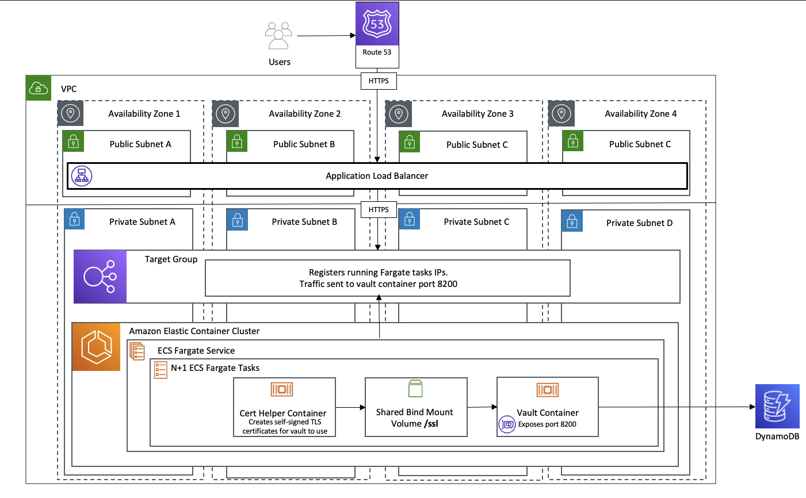

# About

This project creates a highly available Vault cluster backed by DynamoDB and exposed on an Application Load Balancer. 
The ALB will listen over HTTPS on port 443 and HTTP on port 80 which redirects to the HTTPS listener. By default, the security group on the ALB will only have one inbound rule which is a nested security group for the ECS service. Any other inbound rules must be added after deployment to connect.

# Architecture Diagram

> Note: You must already have a VPC deployed with at least two public and two private subnets.



# High Level Deployment Steps
- Create the certhelper container and store in ECR or similar.
- Create and validate an ACM certificate.
- Deploy CloudFormation.
- Map ALB DNS to FQDN in Route53 or other DNS provider.
- Add ingress rules on ALB security group.
- Initialize Vault.

# Cert Helper
For this deployment to work, you must create a container that will generate self-signed certificates. Ideally, this container will reside in ECR.

The cert helper is a container that will generate self-signed certificates specific to the running host each time a new vault task is created. The certhelper container and the vault container share a bind mount at /ssl which is where our deployment will look for the generated certificates. The vault container will not start until the cert helper container is in the COMPLETED status, indicating the certificates are created and available.

To build this container, edit [createcert.sh's](./certhelper-container/createcert.sh) variables. Then perform standard docker build. Example ECR build and push below. Note the ECR repo `certhelper` already exists.

```bash
aws --profile $PROFILENAME ecr get-login-password --region #REGION | docker login --username AWS --password-stdin $AWS_ACCOUNT_ID.dkr.ecr.$REGION.amazonaws.com

cd certhelper-container

docker build . -t $AWS_ACCOUNT_ID.dkr.ecr.$REGION.amazonaws.com/certhelper:latest

docker push $AWS_ACCOUNT_ID.dkr.ecr.$REGION.amazonaws.com/certhelper:latest
```

# Create an ACM certificate for the ALB

Make a new ACM certificate. This certificate must be validated before deploying the CloudFormation.

# Deploy Vault

Run the cloudformation [here](./cloudformation/vault.json)

| *Resources Created by the CloudFormation* |
|:--------:|
| KMS Key |
| KMS Key Alias |
| DynamoDB Table |
| ECS Cluster |
| ECS Service |
| ECS Task Definition |
| Internet Facing Application Load Balancer |
| HTTP ALB Listener |
| HTTPS ALB Listener |
| Target Group |
| ALB Security Group |
| ECS Service Security Group |
| ECS Execution IAM Role |
| ECS Task Execution IAM Role |
| CloudWatch Log Group |

# Map DNS

Map the created ALB DNS to your desired fully qualified domain name.

# Initialize Vault

Scale your ECS service to at least one running task. Add your IP address to allowed inbound rules on the created ALB on port 443.

Once the targets are in-service on the load balancer, initialize Vault by running the following API call:

```bash
curl --request PUT -d '{"recovery_shares": 1, "recovery_threshold": 1}' https://YOUR-DNS-NAME/v1/sys/init
```

This will output something like:
```
{"keys":[],"keys_base64":[],"recovery_keys":["xxxxxxxxxxxxxxxxxxx"],"recovery_keys_base64":["xxxxxxxxxxxxxxxxxx"],"root_token":"xxxxxxxxxxxxxxxxxxxxx"}
```

Make sure you save this information in Secrets manager or similar. These keys can not be retrieved later. The root token is what you will use to initially log in an configure Vault.

# Use Vault

To use Vault, you can connect via the UI, or via the CLI.

[Install Vault](https://www.vaultproject.io/docs/install)

To use the CLI, you must first tell vault where your server is and log in.

```
export VAULT_ADDR='https://your-dns'
vault login
```

You can follow along with Hashicorp's getting started with Vault tutorial [here](https://learn.hashicorp.com/collections/vault/getting-started) at the `your first secret` step if desired.

# Limitations
- ECS Fargate does not support ipc_lock capability which is recommended by Hashicorp to block process memory from being swapped to disk.
- Running more than one vault task can cause long load times since vault will continually redirect to the ALB until it lands on the single primary Vault instance. More information can be found in [Hashicorp's documentation](https://www.vaultproject.io/docs/concepts/ha) under the load balancer section.

# Considerations
- VPC endpoints can be leveraged to connect to DynamoDB and KMS. `AWS_KMS_ENDPOINT` and `AWS_DYNAMODB_ENDPOINT` are the variables vault needs to use them.
- WAF can be attached to ALB.
- Service Discovery can be added to ECS service (would require rebuild of the service if already deployed)
- The UI can be disabled by modifying the ECS task variable `VAULT_LOCAL_CONFIG` to `ui = false ....`. The target group health checks would also need to be updated if this is disabled, as the default healthcheck is `/ui/vault/auth?with=token` which only exists with enabled UI. This can be changed to `/v1/sys/health` but this health check path will only work once the cluster is initialized.
